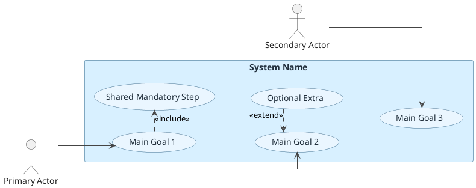

# Layout Style

Use this reference when the diagram looks cluttered, amateur, or mechanically generated.

## Style goal

Prefer a compact, presentation-ready diagram with one obvious reading flow.

Target qualities:
- one main actor on the left
- one main scenario column in the system boundary
- one side column for included or extending support use cases
- short dashed relation arrows
- minimal crossings
- enough whitespace to separate groups
- no decorative use cases added just to fill space

## Default composition

Use this order before writing PlantUML:

1. Pick the primary actor.
2. Pick the 3 to 5 main goal use cases and place them in a vertical column.
3. Place shared mandatory subflows in a nearby secondary column as `include` targets.
4. Place optional extenders on the opposite side of the base use case they extend.
5. Place child actors or child use cases below their parent so generalization is visually obvious.
6. Only then connect associations and dependency arrows.

## Hard limits

- Prefer at most 2 actors unless the assignment clearly needs more.
- Prefer at most 8 use cases for a student diagram.
- Prefer at most 1 shared included use case unless the domain strongly justifies more.
- Prefer at most 1 or 2 extending use cases.
- Avoid chaining `include` into another `include` unless there is a very strong reason.
- Avoid more than one level of use-case generalization in student work.
- If one actor would connect to more than about 4 use cases, simplify or split the scope.

## Layout heuristics

- Put the system boundary in the center with extra horizontal space.
- Keep the most important use case slightly above center.
- Group related use cases vertically instead of scattering them horizontally.
- Keep actor associations mostly horizontal.
- Keep `include` arrows short and usually pointing inward or sideways to a nearby support column.
- Keep `extend` arrows short and usually pointing inward from the opposite side.
- Keep generalization vertical when possible.
- If two arrows would cross, move the bubble first and only then accept the relation.
- Use hidden links in PlantUML to lock vertical columns before adding semantic arrows.

## PlantUML preset

Use this as the default starting point for clean output:

## Template selection

Use one of these patterns instead of inventing a new arrangement every time:

### Pattern A: One main actor, support column

Use when one actor drives most goals.
- Primary actor on the left
- Main goals in a vertical stack
- Shared included use case in a side column close to the reused goals
- Optional extender near the base use case it modifies

### Pattern B: Actor specialization

Use when the cleanest inheritance is between actors.
- Parent actor at upper left or right
- Child actors directly below the parent
- Children inherit parent access instead of duplicating many associations

### Pattern C: Use-case specialization

Use only when one goal really has specialized variants.
- Parent use case above
- Child use cases below
- Keep the rest of the diagram sparse so the specialization stays readable

## Anti-patterns

Avoid these unless the user explicitly asks for them:
- evenly distributing bubbles around the whole boundary
- three or more dashed arrows converging into one use case
- actor lines cutting through the center of the system
- mixing actor generalization and use-case generalization in the same crowded corner
- adding extension points text when it does not help the reader
- squeezing too many use cases into a narrow boundary
- letting one actor create a starburst of diagonal associations
