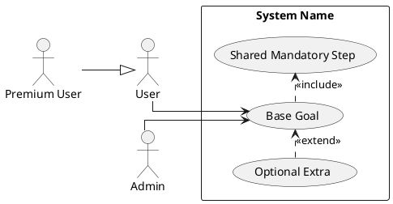

# Use Case Rules

Use this reference as a compact checklist when creating or reviewing a use case diagram.

## Core notation

- Model the system as one named boundary rectangle.
- Place actors outside the system boundary.
- Place use cases inside the system boundary as user goals, not implementation steps.
- Name use cases with verb phrases such as `Place Order`, `Reset Password`, or `Approve Request`.
- Link actors to the use cases they interact with.
- Prefer the standard stereotype spelling `<<include>>` and `<<extend>>`.

## Decision tests

- Ask `Does base use case always perform this reused behavior?` If yes, consider `include`.
- Ask `Can the base use case still make sense and complete without this extra behavior?` If yes, consider `extend`.
- Ask `Is this child really a more specific kind of the parent actor or parent goal?` If yes, consider generalization.

## Relation semantics

### `include`

- Use for mandatory reused behavior.
- Read it as: the base use case always uses the included use case.
- Draw a dashed dependency arrow from the base use case to the included use case.
- Good fit when several use cases share the same required sub-flow.
- Avoid using it merely to decompose every large use case into smaller ones.

### `extend`

- Use for optional, conditional, or exceptional behavior.
- Read it as: the extending use case adds behavior to a complete base use case under certain conditions.
- Draw a dashed dependency arrow from the extending use case to the base use case.
- Use extension points only when the insertion location matters or improves understanding.
- Avoid using it when the extra behavior always happens.

### Inheritance / generalization

- Use only for a real `is-a` specialization.
- Draw a solid line with a hollow triangle pointing to the parent actor or parent use case.
- Actor generalization means the child actor can do everything the parent actor can do, plus more.
- Use-case generalization means the child use case is a specialized form of the parent goal.
- Avoid using inheritance when the relation is merely sequential, optional, or reused behavior.

## Common mistakes

- Modeling pages, buttons, or database operations as use cases.
- Mixing high-level business goals with low-level technical steps in the same diagram.
- Drawing a reversed `include` or reversed `extend` arrow.
- Using `<<extends>>`, `<<exclude>>`, or other non-standard labels in a final diagram.
- Letting stereotype text render as HTML-escaped text such as `&lt;&lt;include&gt;&gt;`.
- Using curved connectors or non-orthogonal routing in the final render.
- Drawing associations between actors instead of using generalization when appropriate.
- Using `include` and `extend` as decoration without clear semantics.
- Giving one actor a fan-out of many diagonal associations that dominate the whole picture.
- Omitting the system name or the boundary.

## Review checklist

- Is every actor external to the system?
- Does every use case express a user-visible goal?
- Are there at least the required number of use cases?
- Is each `include` mandatory and reusable?
- Is each `extend` optional or conditional?
- Is inheritance a real specialization?
- Does the arrow direction match the chosen relation?
- Are all connectors straight or right-angled rather than curved?
- Are dashed-line labels readable and rendered exactly as `<<include>>` or `<<extend>>`?
- Does one actor dominate the layout with too many associations?
- Is the diagram readable without dense crossing lines?

## Minimal PlantUML skeleton

